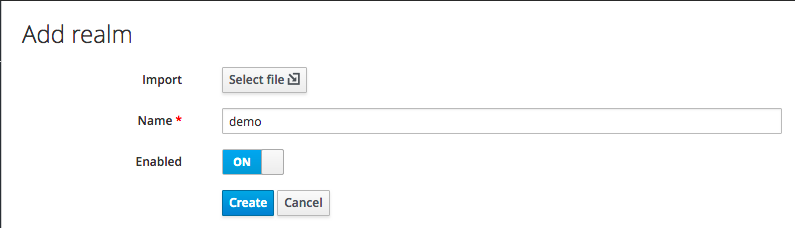
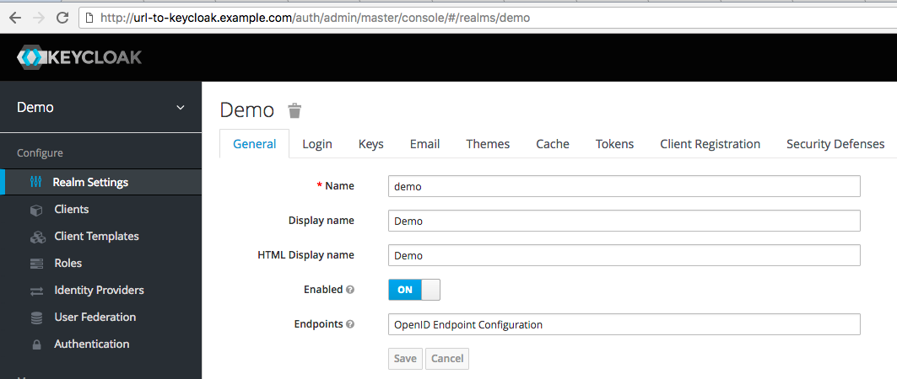
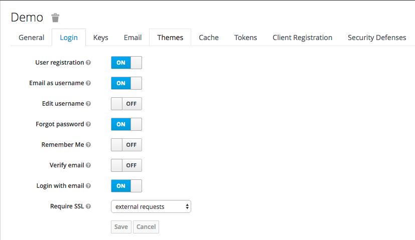
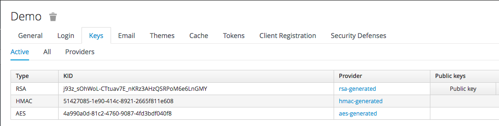
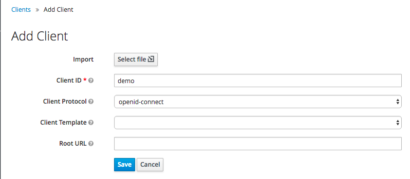
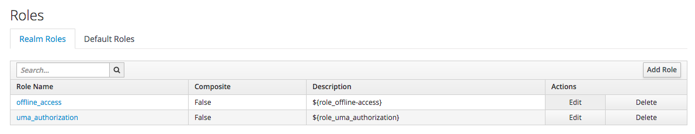
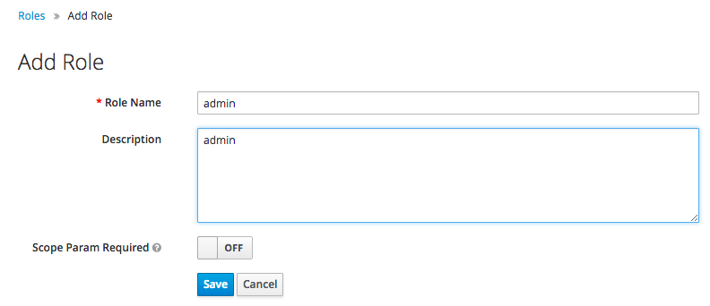

# keycloak-proxy-demo

## Purpose

This demo application is intended to help you understand how to use the Keycloak Proxy and how it works.

- Client only has an authorization for `/user` endpoint

- Keycloak Proxy allows request from client to `/user` endpoint


- Keycloak Proxy denies request from client to `/admin` endpoint


## What is a Keycloak Proxy?

Keycloak has an HTTP(S) proxy that you can put in front of web applications and services where it is not possible to install the Keycloak adapter. You can set up URL filters so that certain URLs are secured either by browser login and/or bearer token authentication. You can also define role constraints for URL patterns within your applications.

Please refer to [Keycloak Proxy](https://www.keycloak.org/docs/3.3/server_installation/topics/proxy.html) for more information.

## Prerequisites

### Prepare Keycloak Environment

Keycloak Proxy is designed primarily for Keycloak, an OpenID Connect identity provider. But it also works with other OpenID Connect identity providers.

You can easily install Keycloak using [Keycloak Helm Chart](https://github.com/kubernetes/charts/tree/master/incubator/keycloak).

### Create Realm, Client and Role

You should create Realm, Client and Role on Keycloak administrator dashboard.

1. Create and configure realm

- Create realm


- Configure realm general


- Configure realm login


- Confirm realm public key


2. Create Client




3. Create Role





## Deploy demo application

Deploy demo application using kubectl.

```
$ kubectl apply -f deployment.yaml
$ kubectl apply -f service.yaml
```

Confirm service and pod are correctly defined and running.

```
$ kubectl get po,svc
NAME                       READY     STATUS    RESTARTS   AGE
po/demo-85cdbcc8c7-6pkbv   1/1       Running   0          10s

NAME               TYPE        CLUSTER-IP      EXTERNAL-IP   PORT(S)   AGE
svc/demo-service   ClusterIP   172.21.189.11   <none>        80/TCP    10s
```
Connect to `http://127.0.0.1:8080/user` and `http://127.0.0.1:8080/admin`.
You are able to see "Hello User!" and "Hello Admin!".
Currently, you can access to `/user` and `/admin` endpoint without authentication.

```
$ kubectl port-forward demo-85cdbcc8c7-6pkbv 8080:8080
Forwarding from 127.0.0.1:8080 -> 808
```

In the next step, we are going to make `/admin` endpoint to be accessed only for user who is authenticated and authorized via Keycloak.

## Deploy Keycloak Proxy

You can easily install Keycloak Proxy using [Keycloak Proxy Helm Chart](https://github.com/kubernetes/charts/tree/master/incubator/keycloak-proxy).

1. Configure `values.yaml`

```
image: jboss/keycloak-proxy
imageTag: 3.4.0.Final
imagePullPolicy: IfNotPresent

service:
  ## ServiceType
  ## ref: https://kubernetes.io/docs/user-guide/services/#publishing-services---service-types
  type: NodePort

  ## Optional static port assignment for service type NodePort.
  nodePort: 32589

  ## HTTP listen port.
  port: 80

## Ingress configuration.
## ref: https://kubernetes.io/docs/user-guide/ingress/
ingress:
  enabled: false

  annotations: {}
    # kubernetes.io/ingress.class: nginx

  ## List of hosts for the ingress
  hosts:
    - keycloak-proxy.example.com

  ## TLS configuration
  tls:
    enabled: false
    existingSecret: ""

configmap:
  targetUrl: http://demo-service
  realm: demo
  realmPublicKey: "MIIBIjANBgkqhkiG9w0BAQEFAAOCAQ8AMIIBCgKCAQEAsLa2YmPyakziINoUgRLrEHLCKcyz62LhLU4JQsbJXMa1Zj4u/bU5D4dau1WkF94ivKV1osvqJqtQ4jCJYfRYrhCYeYOZWB7YFxELj+zMyP72Gxqg/YfWXKrzVnI5MYdZNx52dWAvBVDsDrxiZzJ0Xc92qCdKnEbvpK50XCh15KjWSjucbcJPwGX6kclLCmX0V47ziSo83FjH3ddFP81Kmza3on569Xi0QAAx3g/ZgPgZOSuF9OWwh3aMTwkfx9DlGeU5pY7uqvjuM9v33g0tdpOEelRAqu0aH/HEFXk9Mn74U1GQU/drflQVWEbv+9YvnUJN4cGt0oqmwQYU+Ix4qwIDAQAB"
  authServerUrl: http://url-to-keycloak.example.com/auth
  resource: demo
  secret: 2b2c17f0-245e-4978-a663-9a02a268a8f4
  pattern: /admin
  rolesAllowed: admin
```

2. Deploy Keycloak Proxy
```
$ helm install --name keycloak-proxy -f values.yaml incubator/keycloak-proxy
NAME:   keycloak-proxy
LAST DEPLOYED: Wed May 16 01:17:25 2018
STATUS: DEPLOYED

RESOURCES:
==> v1beta1/Deployment
NAME            DESIRED  CURRENT  UP-TO-DATE  AVAILABLE  AGE
keycloak-proxy  1        1        1           0          0s

==> v1/Pod(related)
NAME                             READY  STATUS             RESTARTS  AGE
keycloak-proxy-67df99bbd5-ckfx7  0/1    ContainerCreating  0         0s

==> v1/ConfigMap
NAME                      DATA  AGE
keycloak-proxy-configmap  1     0s

==> v1/Service
NAME                    TYPE      CLUSTER-IP     EXTERNAL-IP  PORT(S)       AGE
keycloak-proxy-service  NodePort  172.21.215.70  <none>       80:32589/TCP  0s


NOTES:
1. Keycloak Proxy can be accessed:

   * Within your cluster, at the following DNS name at port 80:

     keycloak-proxy.demo.svc.cluster.local

   * From outside the cluster, run these commands in the same shell:

     export NODE_PORT=$(kubectl get --namespace demo -o jsonpath="{.spec.ports[0].nodePort}" services keycloak-proxy-service)
     export NODE_IP=$(kubectl get nodes --namespace demo -o jsonpath="{.items[0].status.addresses[0].address}")
     echo http://$NODE_IP:$NODE_PORT
```

## Connect to demo application with authentication and authorization


## Summary
