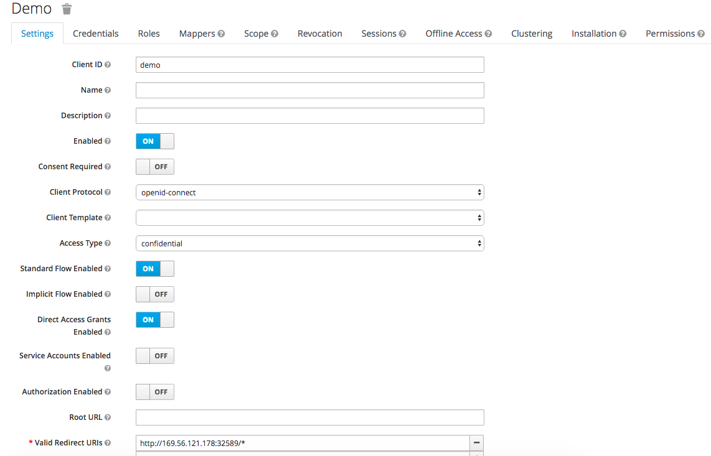
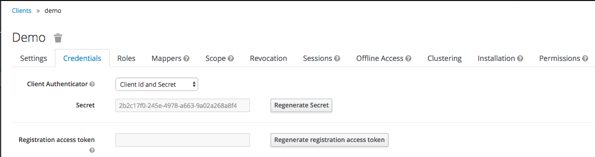

# keycloak guide

## Create and configure realm

1. Create realm

2. Configure realm general

3. Configure realm login

4. Confirm realm public key
 Click "Public key" button and confirm the key on pop-up window.

## Create Client

1. Click "Create" button

2. Insert "Client ID" and Save

3. Configure client settings
 Note: Valid Redirect URIs is a list of URLs to accept as Redirect URLs. 
In this article, we will use `http://WORK_NODE_IP:NODE_PORT` as Redirect URL. 

4. Confirm client secret

## Create Role

1. Click "Add Role" button

2. Insert "admin" and Save

